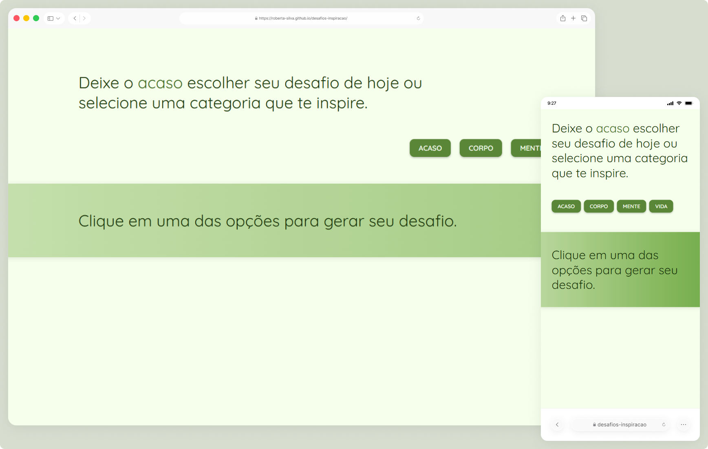

# Inspiração do Dia 🌟

Aplicação web interativa que gera desafios e mensagens motivacionais curtas, pensadas para incentivar ações positivas no dia a dia.
O usuário pode escolher uma categoria específica ou receber uma sugestão aleatória, tornando a experiência simples e dinâmica.

### 👉 Acesse o projeto: 
[https://roberta-silva.github.io/desafios-inspiracao/](https://roberta-silva.github.io/desafios-inspiracao/)

## 🔹 Funcionalidades
- Geração de desafios motivacionais por categoria
- Opção de sugestão aleatória
- Interface simples, intuitiva e responsiva
- Conteúdo exibido dinamicamente sem recarregar a página

## 🔹 Tecnologias Utilizadas

- **HTML5** → estrutura da página
- **CSS3** → estilização, layout responsivo e foco no aprimoramento das boas práticas
- **JavaScript** → lógica de geração aleatória, filtros por categoria e manipulação do DOM

## 🔹 Objetivo do Projeto

Projeto desenvolvido com foco em prática e consolidação de fundamentos de frontend, especialmente:

- Estruturação e organização de layout com CSS
- Criação de uma experiência visual agradável e usável
- Manipulação do DOM com JavaScript puro
- Aplicação de lógica para conteúdo dinâmico

## 🔹 Preview

