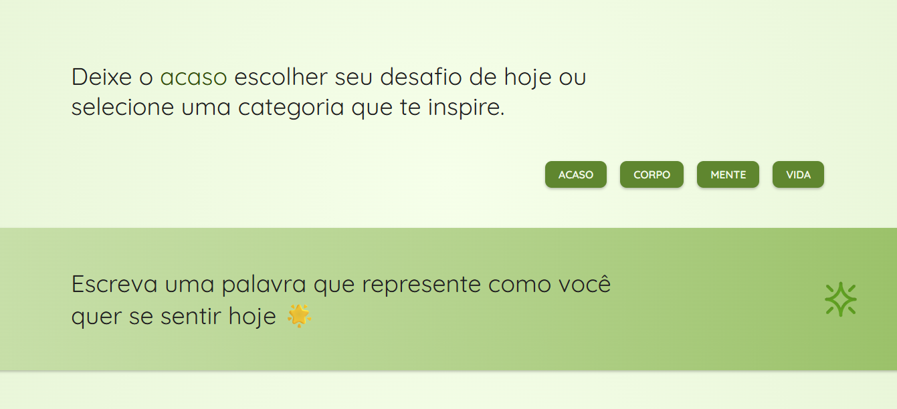

# Inspiração do Dia ✨

Inspiração do Dia é uma aplicação web interativa que gera desafios e mensagens motivacionais curtas, pensadas para incentivar ações positivas no dia a dia. O usuário pode escolher uma categoria específica ou receber uma sugestão aleatória, tornando a experiência simples, dinâmica e personalizada. O projeto foi desenvolvido para praticar manipulação do DOM, lógica de programação aplicada a conteúdos dinâmicos e boas práticas de organização de layout.

> Status do projeto: Concluído ✔️

## Acesse o projeto

🔗 [https://roberta-silva.github.io/desafios-inspiracao/](https://roberta-silva.github.io/desafios-inspiracao/)

## Funcionalidades
- Geração de desafios motivacionais por categoria  
- Opção de sugestão aleatória  
- Interface simples, intuitiva e responsiva  
- Conteúdo exibido dinamicamente sem recarregar a página  

## Objetivos técnicos
- Estruturação e organização de layout com CSS  
- Criação de uma experiência visual agradável e usável  
- Manipulação do DOM com JavaScript puro  
- Aplicação de lógica para conteúdo dinâmico  

## Tecnologias
- HTML5  
- CSS3  
- JavaScript (ES6+)  

## 👀 Preview

